## Abstract

> The human intrinsic desire to pursue knowledge, also known as curiosity, is considered essential in the process of skill acquisition. With the aid of artificial curiosity, we could equip current techniques for control, such as Reinforcement Learning, with more natural exploration capabilities. A promising approach in this respect has consisted of using Bayesian surprise on model parameters, i.e. a metric for the difference between prior and posterior beliefs, to favour exploration. In this contribution, we propose to apply Bayesian surprise in a latent space representing the agent’s current understanding of the dynamics of the system, drastically reducing the computational costs. We extensively evaluate our method by measuring the agent's performance in terms of environment exploration, for continuous tasks, and looking at the game scores achieved, for video games. Our model is computationally cheap and compares positively with current state-of-the-art methods on several problems. We also investigate the effects caused by stochasticity in the environment, which is often a failure case for curiosity-driven agents. In this regime, the results suggest that our approach is resilient to stochastic transitions.

### Visual Control Zero-shot Benchmark

This experiment evaluates the performance in a zero-shot learning setting (also see [Sekar et al. 2020](https://arxiv.org/abs/2005.05960) for details). 

The model and the agent are trained without rewards, collecting data through exploration. Some of the curiosity-driven behaviours learned in this phase with Latent Bayesian Surprise are showed in the GIF, under the <b>Exploration</b> column.

Along the exploration process, snapshots of the agent's model are used to train a task policy on the final task and plot its zero-shot performance. These behaviours are shown under the <b>Task</b> column.

  

    
<b>Exploration</b>

  

  

    
<b>Task</b>

  

 

  

  

     
    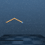
  

  

  

    

        Acrobot Swingup
        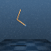
    

  

 

  

    

         
        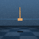
    

  

  

    

        Cartpole Balance
        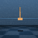
    

    

        Cartpole Swingup
        
    

  

 

  

    

         
        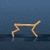
    

  

  

    

        Cheetah Run
        
    

  

 

  

    

         
        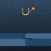
    

  

  

    

        Cup Catch
        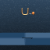
    

  

 

  

    

         
        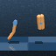
    

    

         
        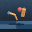
    

    

         
        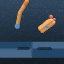
    

  

  

    

        Finger Spin
        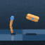
    

    

        Finger Turn Easy
        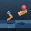
    

    

        Finger Turn Hard
        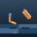
    

  

 

  

    

         
        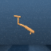
    

  

  

    

        Hopper Stand
        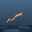
    

    

        Hopper Hop
        
    

  

 

  

    

         
        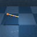
    

  

  

    

        Pendulum Swingup
        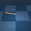
    

  

 

  

    

         
        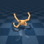
    

  

  

    

        Quadruped Walk
        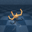
    

    

        Quadruped Run
        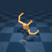
    
    
  

 

  

    

         
        
    

    

         
        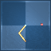
    

  

  

    

        Reacher Easy
        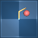
    

    

        Reacher Hard
        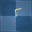
    

  

 

  

    

         
        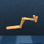
    

  

  

    

        Walker Stand
        
    

    

        Walker Walk
        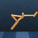
    

    

        Walker Run
        
    

  

### Arcade Games Experiments

The curves show the game score achieved during an episode of training. Agents learn using only the intrinsic motivation signal.

    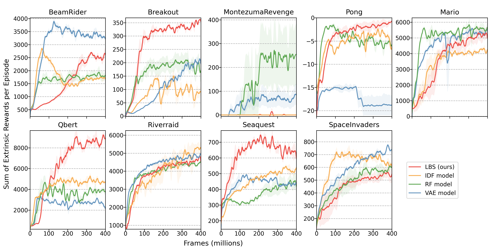

To incentivize comparison against our baseline, we make public the data used in the plots, which can be easily integrated with the original [Large-Scale Study of Curiosity-Driven Learning](https://github.com/openai/large-scale-curiosity) open-source implementation.

<a href="/resources/lbs_arcade_results.zip" download>Download Data [.zip]</a>

They follow videos of the agents playing the games, driven only by their curiosity.

    

    <h4> BeamRider </h4> 
        <video style=' background-color: rgba(0, 0, 0, 0)' src="./resources/BeamRider-6140.mp4" width="90%" controls preload></video>
    

    

    <h4> Breakout </h4> 
        <video style=' background-color: rgba(0, 0, 0, 0)' src="./resources/Breakout-425.mp4" width="90%" controls preload></video>
    

    

    <h4> Montezuma Revenge</h4> 
        <video style=' background-color: rgba(0, 0, 0, 0)' src="./resources/MontezumaRevenge-1400.mp4" width="90%" controls preload></video>
    

    

    <h4> Pong </h4>
        <video style=' background-color: rgba(0, 0, 0, 0)' src="./resources/Pong-2-4.mp4" width="90%" controls preload></video>
    

    

        <h4> Qbert </h4>
        <video style=' background-color: rgba(0, 0, 0, 0)' src="./resources/Qbert-15600.mp4" width="90%" controls preload></video>
    

    

        <h4> Riverraid</h4>
        <video style=' background-color: rgba(0, 0, 0, 0)' src="./resources/Riverraid-6890.mp4" width="90%" controls preload></video>
    

    

        <h4> Seaquest</h4>
        <video style=' background-color: rgba(0, 0, 0, 0)' src="./resources/Seaquest-1060.mp4" width="90%" controls preload></video>
    

    

        <h4> Space Invaders</h4>
        <video style=' background-color: rgba(0, 0, 0, 0)' src="./resources/SpaceInvaders-1370.mp4" width="90%" controls preload></video>
    

<h4> Super Mario Bros.</h4>

    

    

        <video style=' background-color: rgba(0, 0, 0, 0)' src="./resources/MarioBros-pipe-world-1.mp4" width="90%" controls preload></video>
    

    

        <video style=' background-color: rgba(0, 0, 0, 0)' src="./resources/MarioBros-all-world-1.mp4" width="90%" controls preload></video>
    

    

