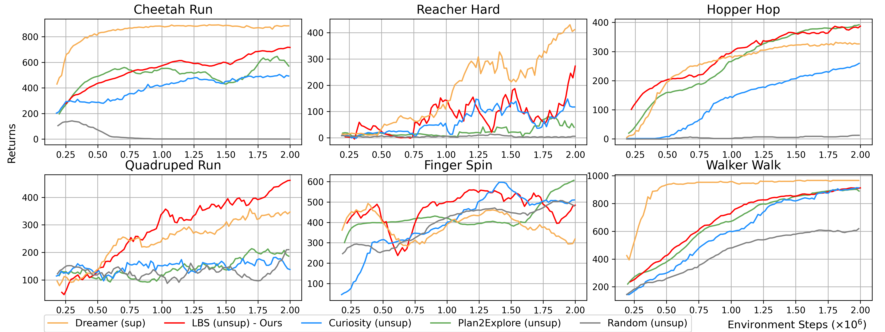

## Abstract

The human intrinsic desire to pursue knowledge, also known as curiosity, is considered essential in the process of skill acquisition. With the aid of artificial curiosity, we could equip current techniques for control, such as Reinforcement Learning, with more natural exploration capabilities. A promising approach in this respect has consisted of using Bayesian surprise on model parameters, i.e. a metric for the difference between prior and posterior beliefs, to favour exploration. In this contribution, we propose to apply Bayesian surprise in a latent space representing the agent’s current understanding of the dynamics of the system, drastically reducing the computational costs. We extensively evaluate our method by measuring the agent's performance in terms of environment exploration, for continuous tasks, and looking at the game scores achieved, for video games. Our model is computationally cheap and compares positively with current state-of-the-art methods on several problems. We also investigate the effects caused by stochasticity in the environment, which is often a failure case for curiosity-driven agents. In this regime, the results suggest that our approach is resilient to stochastic transitions.

### Comparison with RIDE and NGU

In the plot, we compare against RIDE ([Raileanu et al. 2020](https://arxiv.org/abs/2002.12292)) and Never Give Up (NGU; [Badia et al. 2020](https://arxiv.org/abs/2002.06038)) in the same continuous control and stochastic experiments presented in the paper.

    

 

For the sake of understanding the impact of episodic novelty, we also experimented with a RIDE baseline without the episodic term (i.e. w/o count). The results show that episodic novelty improves performance, especially in stochastic settings. 

Overall, the Latent Bayesian Surprise approach performs best, being more resilient to stochasticity (i.e. Frozen/EvolvingOriginalState) and exploring more efficiently in large state/action spaces (i.e. HalfCheetah).

### Visual Control Zero-shot Benchmark

    

This experiment evaluates the performance on a zero-shot setting (see [Sekar et al. 2020](https://arxiv.org/abs/2005.05960) for details). 

The model and the agent are trained without rewards, collecting data through exploration. Some of the curiosity-driven behaviours learned in this phase with Latent Bayesian Surprise are showed in the GIF, under the <b>Exploration</b> column.

Along the exploration process, snapshots of the agent's model are used to train a task policy on the final task and plot its zero-shot performance. These behaviours are shown under the <b>Task</b> column.

Performance curves in terms of environment returns are showed, comparing against:
- *Dreamer* ([Hafner et al. 2020](https://arxiv.org/abs/1912.01603)): a supervised approach that collects data and trains the model and the agent having access to rewards.
- *Curiosity* ([Pathak et al. 2017](https://arxiv.org/abs/1705.05363)): an unsupervised approach where the agent explores looking for states that maximize the error prediction of its model.
- *Plan2Explore* ([Sekar et al. 2020](https://arxiv.org/abs/2005.05960)): an unsupervised approach where the agent explores looking for states that maximize the variance of an ensemble of predictors about the hidden state of the model.
- *Random*: a random action baseline.

(The results of the baselines reflect the original results presented in the Plan2Explore paper. More visualizations coming soon!)

    

Latent Bayesian Surprise performs significantly better than Plan2Explore in 3 tasks, than Curiosity in 4 tasks, and than Random in 5 tasks. In the remaining tasks, performance are comparable.

In 3 tasks (Cheetah Run, Hopper Hop and Quadruped Run), Latent Bayesian Surprise even outperforms the Dreamer supervised baseline.  

### Arcade Games Experiments

The curves show the game score achieved during an episode of training. Agents learn using only the intrinsic motivation signal.

    

To incentivize comparison against our baseline, we make public the data used in the plots, which can be easily integrated with the original [Large-Scale Study of Curiosity-Driven Learning](https://github.com/openai/large-scale-curiosity) open-source implementation.

<a href="/resources/lbs_arcade_results.zip" download>Download Data [.zip]</a>

They follow videos of the agents playing the games, driven only by their curiosity.

    

    <h4> BeamRider </h4> 
        <video style=' background-color: rgba(0, 0, 0, 0)' src="./resources/BeamRider-6140.mp4" width="90%" controls preload></video>
    

    

    <h4> Breakout </h4> 
        <video style=' background-color: rgba(0, 0, 0, 0)' src="./resources/Breakout-425.mp4" width="90%" controls preload></video>
    

    

    <h4> Montezuma Revenge</h4> 
        <video style=' background-color: rgba(0, 0, 0, 0)' src="./resources/MontezumaRevenge-1400.mp4" width="90%" controls preload></video>
    

    

    <h4> Pong </h4>
        <video style=' background-color: rgba(0, 0, 0, 0)' src="./resources/Pong-2-4.mp4" width="90%" controls preload></video>
    

    

        <h4> Qbert </h4>
        <video style=' background-color: rgba(0, 0, 0, 0)' src="./resources/Qbert-15600.mp4" width="90%" controls preload></video>
    

    

        <h4> Riverraid</h4>
        <video style=' background-color: rgba(0, 0, 0, 0)' src="./resources/Riverraid-6890.mp4" width="90%" controls preload></video>
    

    

        <h4> Seaquest</h4>
        <video style=' background-color: rgba(0, 0, 0, 0)' src="./resources/Seaquest-1060.mp4" width="90%" controls preload></video>
    

    

        <h4> Space Invaders</h4>
        <video style=' background-color: rgba(0, 0, 0, 0)' src="./resources/SpaceInvaders-1370.mp4" width="90%" controls preload></video>
    

<h4> Super Mario Bros.</h4>

    

    

        <video style=' background-color: rgba(0, 0, 0, 0)' src="./resources/MarioBros-pipe-world-1.mp4" width="90%" controls preload></video>
    

    

        <video style=' background-color: rgba(0, 0, 0, 0)' src="./resources/MarioBros-all-world-1.mp4" width="90%" controls preload></video>
    

    

