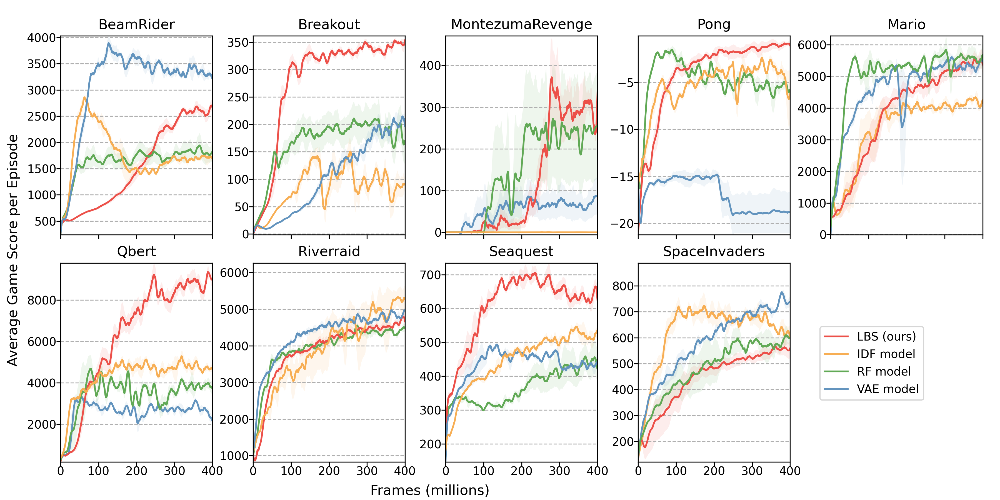

## Abstract

Training with Reinforcement Learning requires a reward function that is used to guide the agent towards achieving its objective. However, designing smooth and well-behaved rewards is in general not trivial and requires significant human engineering efforts. Generating rewards in self-supervised way, by inspiring the agent with an intrinsic desire to learn and explore the environment,  might induce more general behaviours. In this work, we propose a curiosity-based bonus as intrinsic reward for Reinforcement Learning, computed as the Bayesian surprise with respect to a latent state variable, learnt by reconstructing fixed random features. We extensively evaluate our model by measuring the agent's performance in terms of environment exploration, for continuous tasks, and looking at the game scores achieved, for video games. Our model is computationally cheap and empirically shows state-of-the-art performance on several problems. Furthermore, experimenting on an environment with stochastic actions, our approach emerged to be the most resilient to simple stochasticity.

### Arcade Games Experiments

The curves show the game score achieved during an episode of training by agents learning only using the intrinsic motivation signal.

To incentivize comparison against our baseline, we make public the data used in the plots, which can be easily integrated with the original [Large-Scale Study of Curiosity-Driven Learning](https://github.com/openai/large-scale-curiosity) open-source implementation.

<a href="/resources/lbs_arcade_results.zip" download>Download Data [.zip]</a>

They follow videos of the agents playing the games, driven only by their curiosity.

### BeamRider 
<video style=' background-color: rgba(0, 0, 0, 0)' src="./resources/BeamRider-6140.mp4" width="100%" controls preload></video>

### Breakout 
<video style=' background-color: rgba(0, 0, 0, 0)' src="./resources/Breakout-425.mp4" width="100%" controls preload></video>

### Montezuma Revenge
<video style=' background-color: rgba(0, 0, 0, 0)' src="./resources/MontezumaRevenge-left-bugs.mp4" width="100%" controls preload></video>

### Pong
<video style=' background-color: rgba(0, 0, 0, 0)' src="./resources/Pong-2-4.mp4" width="100%" controls preload></video>

### Qbert
<video style=' background-color: rgba(0, 0, 0, 0)' src="./resources/Qbert-15600.mp4" width="100%" controls preload></video>

### Seaquest
<video style=' background-color: rgba(0, 0, 0, 0)' src="./resources/Seaquest-1060.mp4" width="100%" controls preload></video>

### Space Invaders
<video style=' background-color: rgba(0, 0, 0, 0)' src="./resources/SpaceInvaders-1370.mp4" width="100%" controls preload></video>

### Super Mario Bros.
<video style=' background-color: rgba(0, 0, 0, 0)' src="./resources/MarioBros-pipe-world-1.mp4" width="100%" controls preload></video>

<video style=' background-color: rgba(0, 0, 0, 0)' src="./resources/MarioBros-all-world-1.mp4" width="100%" controls preload></video>

